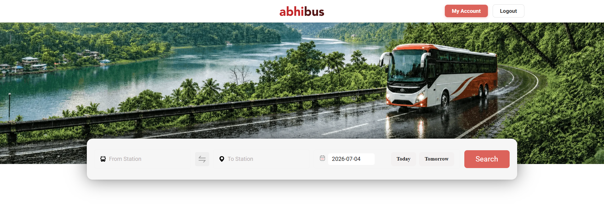
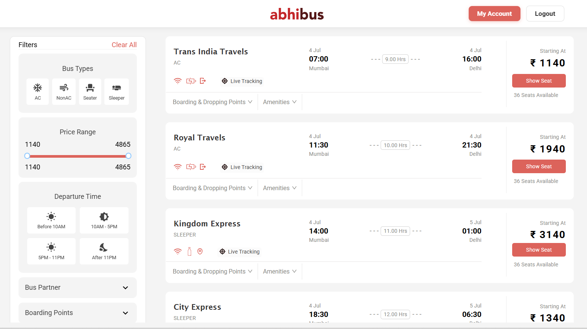
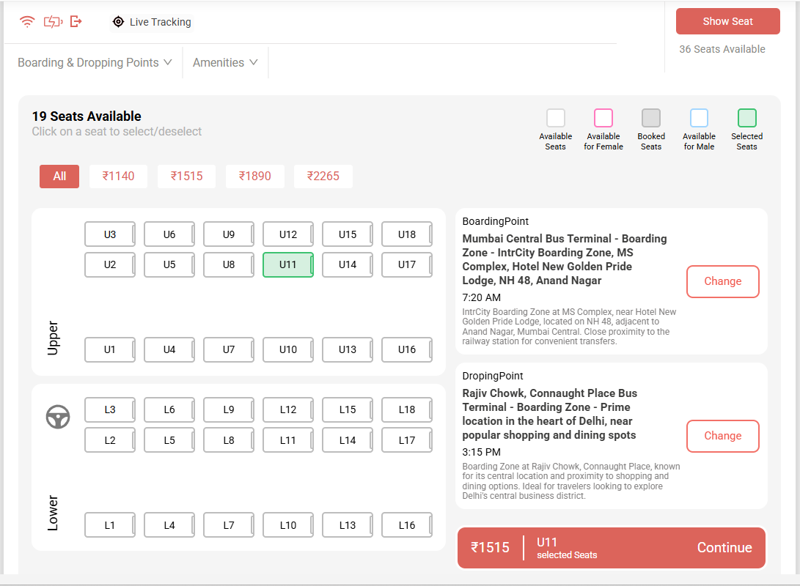
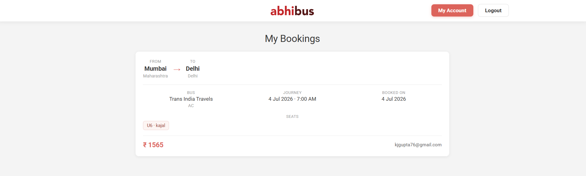

# OnRoadBooking — Frontend

React client for the OnRoadBooking bus reservation platform.

> Full project documentation (features, screenshots, tech stack, setup): see [../README.md](../README.md)

## Quick Start

```bash
npm install
npm start
```
backend_github_url : https://github.com/kajal-1999-cloud/busbooking_backend

Runs at [http://localhost:3000](http://localhost:3000). Requires the API at `http://localhost:8080` (`busbooking_updated`).

## Screenshots

| Page | Preview |
|------|---------|
| Home |  |
| Trip list |  |
| Seat layout |  |
| My bookings |  |
